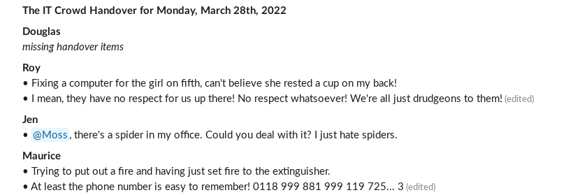

# Handover

> A slackbot for writing handover posts



## Running

### From Source

```shell
git clone https://github.com/Runn-Fast/handover
cd handover

cat << EOF > .env
SLACK_APP_TOKEN=xapp-1-***********-*************-****************************************************************
SLACK_BOT_TOKEN=xoxp-**********-************-************-********************************
SLACK_SIGNING_SECRET=********************************
SLACK_CHANNEL=C********
HANDOVER_CONFIG='[{"title":"The IT Crowd", "timezone":"Europe/London", "schedule":"0 10 * * 1-5", "remindAt":"0 18 * * 1-5", "users":["roy", "moss", "jen"]}]'
EOF

pnpm install
pnpm run build
pnpm start
```

## Slack App Manifest

```json
{
    "display_information": {
        "name": "Handover Bot"
    },
    "features": {
        "bot_user": {
            "display_name": "Handover Bot",
            "always_online": true
        }
    },
    "oauth_config": {
        "scopes": {
            "bot": [
                "chat:write",
                "users:read",
                "users.profile:read",
                "im:history"
            ]
        }
    },
    "settings": {
        "event_subscriptions": {
            "bot_events": [
                "message.im"
            ]
        },
        "interactivity": {
            "is_enabled": true
        },
        "org_deploy_enabled": false,
        "socket_mode_enabled": true,
        "token_rotation_enabled": false
    }
}
```

## Environment Variables

```
CACHE_DIR: (string, optional) Path to a directory for where to write cache files. Default `/tmp/handover`
SLACK_APP_TOKEN: (string) Slack APP Access Token. Starts with `xapp-`.
SLACK_BOT_TOKEN: (string) Slack Bot Access Token . Starts with `xoxb-`.
SLACK_SIGNING_SECRET: (string) Slack Signing Secret.
SLACK_CHANNEL: (string) ID of the Slack channel to post the handover to.
PORT: (number, optional) The port to start the server on. Default `3000`.
HANDOVER_CONFIG: JSON formatted string of the handover config (see below).
```

## How It Works

## Handover Config

This config is used to automate daily posts.

```json5
[
  {
    "title": "The IT Crowd",
    "timezone": "Europe/Timezone",

    // see https://crontab.guru
    "schedule": "0 10 * * 1-5",
    "remindAt": "0 18 * * 1-5",

    // list of slack usernames
    "users": [
      "roy",
      "moss",
      "jen"
    ]
  }
]
```
