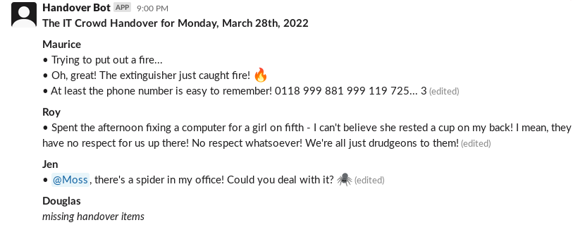

# Handover

> A slackbot for writing handover posts



## Prerequisite

Make sure you have pnpm installed globally. If not, run the following command:

```
npm install -g pnpm
```

## Running

1. Create an .env file

```shell
cp .env.template .env
```

2. Get the required credentials from `1Password` for `Handover Bot Test Env(ZilchWorld)`, and paste them into the `.env` file. Replace the placeholder for `SLACK_APP_TOKEN`, `SLACK_BOT_TOKEN`, `SLACK_SIGNING_SECRET`, `HANDOVER_CHANNEL`, and `HANDOVER_TITLE`

3. In the `.env` file, change `runn_handover_test` to `runn_handover`

4. create a new database for the dev environment

```shell
pnpm prisma db push
```

5. There's a Slack workspace for testing called `Zilchworld`. Create a new account on `zilchworld.slack.com` or request access on the #dev-handover channel

6. Run the handover bot locally

```shell
pnpm run dev
```

7. Now you'll be able to run and test the handover bot on ZilchWorld!

## Run Tests

```shell
cp .env.template .env.test

# update DATABASE_URL to point to Postgre
edit .env.test

# install dependencies (if you haven't already)
pnpm install

# run database migrations
pnpm prisma:test db push

# run tests!
pnpm run test
```

## DB migration

1. Update the `schema.prisma` file (for more details about Prisma Schema, please visit [Prisma Docs](https://www.prisma.io/docs/concepts/components/prisma-schema))

2. To create and run a new migration automatically for applying schema changes, run the following command:

```shell
pnpm prisma migrate dev --name=[name for migration]
```

## Troubleshooting

For any questions or discussions, please flick a message on #dev-handover
