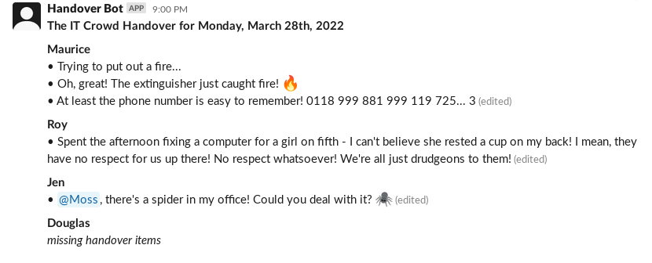

# Handover

> A slackbot for writing handover posts



## Usage

The bot is driven entirely from Slack. There are two ways to interact with it:

1. **Posting handover items** — write a normal message in the handover channel.
2. **Running commands** — `@mention` the bot followed by a command.

### Posting a handover item

Any message you post in the handover channel becomes an item in your handover
post for the day. The bot keeps your published handover in sync with what you
write:

- **Edit** one of your messages and the corresponding item is updated.
- **Delete** one of your messages and the item is removed.

#### Backdating an item

Prefix a message with a relative date in parentheses to file it against a
previous day instead of today:

| Prefix             | Meaning                                  |
| ------------------ | ---------------------------------------- |
| `(today): …`       | Today (the default if no prefix is used) |
| `(yesterday): …`   | The previous day                         |
| `(2 days ago): …`  | _N_ days before today                    |
| `(1 day late): …`  | _N_ days before today, flagged as late   |

Items filed against an earlier day with `… days ago` / `… days late` are shown
in the handover with a `(N days late)` note.

### Commands

Commands are issued by `@mention`-ing the bot and then typing a CLI-style
command, for example:

```
@handover remind --at 09:30
```

Arguments are parsed like a shell, so wrap values containing spaces in quotes.
Run any command (or sub-command) with no arguments, or pass `--help`, to see its
usage. Command responses are sent to you privately so they don't clutter the
channel.

#### `remind` — set your daily reminder

Control when the bot reminds you to post your handover. Reminders are only sent
on your configured workdays.

| Command                       | Description                                         |
| ----------------------------- | --------------------------------------------------- |
| `@handover remind`            | Show your current reminder time                     |
| `@handover remind --at 09:30` | Set the time of day (`HH:MM`) to be reminded        |

If you never set a time, the default of `17:00` is used. (`-t` is shorthand for
`--at`.)

#### `workdays` — choose which days you're reminded

| Command                                    | Description                          |
| ------------------------------------------ | ------------------------------------ |
| `@handover workdays`                       | Show your current workdays           |
| `@handover workdays on Monday Tuesday`     | Turn reminders on for the given days |
| `@handover workdays off Friday`            | Turn reminders off for the given days |

Days are case-insensitive and accept `Monday` through `Sunday`. The `on`/`off`
commands accept one or more days at a time.

#### `history` — review past handovers

Fetch a private copy of your previous handover posts.

| Command                              | Description                              |
| ------------------------------------ | ---------------------------------------- |
| `@handover history`                  | Show the last 7 days of handovers        |
| `@handover history --days-before 14` | Show the last _N_ days (maximum 30)      |

(`-d` is shorthand for `--days-before`.)

#### `format` — customise how handover text is rendered

Formats are regular-expression find-and-replace rules applied to **everyone's**
handover items when they are rendered. They're useful for turning shorthand into
links, emoji, or richer formatting. Each rule has a unique `id` so it can be
updated or deleted later.

| Command                                                  | Description                          |
| -------------------------------------------------------- | ------------------------------------ |
| `@handover format` / `@handover format list`            | List all formats                     |
| `@handover format set <id> <pattern> <replacement>`     | Create or update a format            |
| `@handover format delete <id>`                          | Delete a format                      |

- `<pattern>` is a JavaScript regular expression (e.g. `/PR-(\d+)/g`).
- `<replacement>` is the replacement string and may reference capture groups
  (e.g. `$1`).
- Add a human-readable note with `-d` / `--description`.

For example, to turn `PR-123` into a link:

```
@handover format set pr-link "/PR-(\d+)/g" "<https://github.com/runn/repo/pull/$1|PR-$1>" --description "Link PR references"
```

## Prerequisite

Make sure you have pnpm installed globally. If not, run the following command:

```
npm install -g pnpm
```

## Running

1. Create an .env file

```shell
cp .env.template .env
```

2. Get the required credentials from `1Password` for `Handover Bot Test Env(ZilchWorld)`, and paste them into the `.env` file. Replace the placeholder for `SLACK_APP_TOKEN`, `SLACK_BOT_TOKEN`, `SLACK_SIGNING_SECRET`, `HANDOVER_CHANNEL`, and `HANDOVER_TITLE`

3. In the `.env` file, change `runn_handover_test` to `runn_handover`

4. create a new database for the dev environment

```shell
pnpm prisma db push
```

5. There's a Slack workspace for testing called `Zilchworld`. Create a new account on `zilchworld.slack.com` or request access on the #dev-handover channel

6. Run the handover bot locally

```shell
pnpm run dev
```

7. Now you'll be able to run and test the handover bot on ZilchWorld!

## Run Tests

```shell
cp .env.template .env.test

# update DATABASE_URL to point to Postgres
edit .env.test

# install dependencies (if you haven't already)
pnpm install

# run database migrations
pnpm prisma:test db push

# run tests!
pnpm run test
```

## DB migration

1. Update the `schema.prisma` file (for more details about Prisma Schema, please visit [Prisma Docs](https://www.prisma.io/docs/concepts/components/prisma-schema))

2. To create and run a new migration automatically for applying schema changes, run the following command:

```shell
pnpm prisma migrate dev --name=[name for migration]
```

## Troubleshooting

For any questions or discussions, please flick a message on #dev-handover
